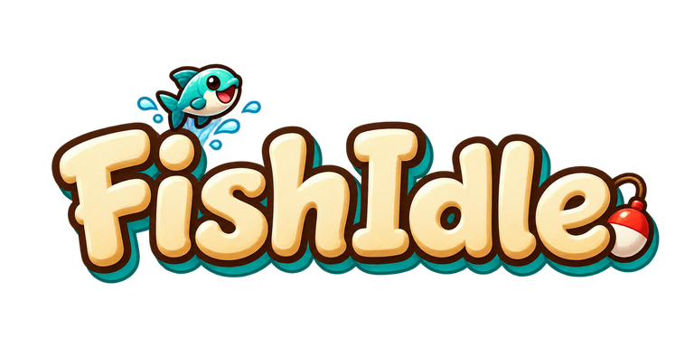
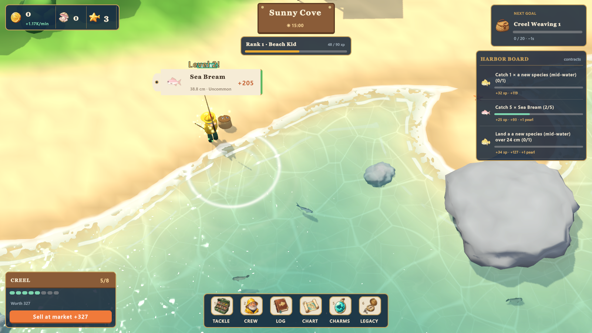

A cozy idle fishing game. Your crew of fishermen casts on their own while you upgrade gear, fill the Catch Log, climb the Angler ranks and sail to new waters, from Sunny Cove all the way to the Ember Caldera.

## Download

**[Download FishIdle for Windows (zip)](https://github.com/Adolanium/fishidle-download/releases/latest/download/FishIdle.zip)**

1. Unzip it anywhere.
2. Run `FishIdle/FishIdle.exe` (Windows 10/11, 64-bit).
3. If Windows SmartScreen says it doesn't recognize the app, click **More info** then **Run anyway**. The game isn't code-signed.

## Controls

| Key | Action |
|---|---|
| Space / click the orange `!` | Perfect hook while a fish bites (chain them for a value streak) |
| 1 – 6 | Tackle, Crew, Log, Chart, Charms, Legacy |
| Mouse wheel · Q / E | Zoom |
| Right-drag · WASD | Move the camera |
| Esc | Close a panel, or open the menu (settings, help, quit) |

Progress saves automatically.
